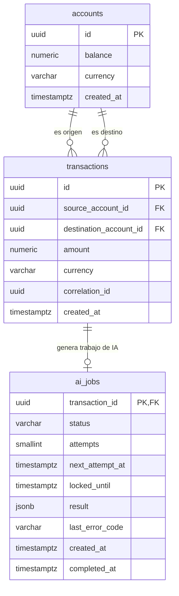

# SmartBancs App — Documento de Arquitectura

## 1. Objetivo y Alcance

Este documento y el código que lo acompaña resuelven el reto técnico "SmartBancs App".

## 2. Stack Tecnológico Elegido

| Componente | Tecnología | Justificación |
|---|---|---|
| API transaccional | Python + FastAPI | I/O-bound, concurrencia con asyncio, tipado con Pydantic, fácil de instrumentar. |
| Base de datos transaccional | PostgreSQL | ACID fuerte, índices, particionamiento, MVCC, soporte de observabilidad (`pg_stat_activity`, `pg_locks`). |
| Cache | Redis | Baja latencia, soporta patrón pub/sub y colas de consumidores para desacoplar IA y sync con Bancs. |
| Patrón de integración con Bancs | Outbox + workers batch | Evita saturar el core legado con escritura directa. |
| Servicio de IA | Microservicio independiente (FastAPI) | Aislar el módulo de IA para ser consumido de forma asíncrona. |
| Observabilidad | Grafana + Prometheus | Estándar de facto, bajo costo de operación, exportable a Grafana/Loki/Tempo. |
| IaC | Docker Compose | Un solo comando (`docker compose up`) levanta todo el entorno de desarrollo. |

---

## 3. Arquitectura de la App

<!-- Imagen de la arqui -->

## 4. Modelado de la Base de Datos

| Tabla | Responsabilidad | Motivo |
| --- | --- | --- |
| `accounts` | Contiene las cuentas que pueden enviar o recibir dinero. | Evita recalcular todo el historial para conocer el saldo. |
| `transactions` | Transferencias confirmadas entre dos cuentas. | Conserva el movimiento e impide duplicar su identificador. |
| `ai_jobs` | Una tarea de IA por transferencia, con intentos y resultado. | Permite ejecutar la recomendación después de confirmar el dinero. |

Una cuenta puede ser origen o destino de muchas transferencias. Cada tarea pertenece a una sola transferencia: `transaction_id` es clave primaria y foránea. La FK permite cero o una tarea; la futura API debe crear exactamente una junto con la transferencia, dentro de la misma transacción SQL.

## 5. Estrategia de Sincronización con Legacy Bancs

**Problema**: Bancs es un sistema transaccional heredado, robusto pero poco flexible, que no puede recibir un alto volumen de consultas directas sin que su rendimiento se degrade.