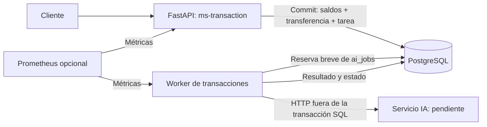
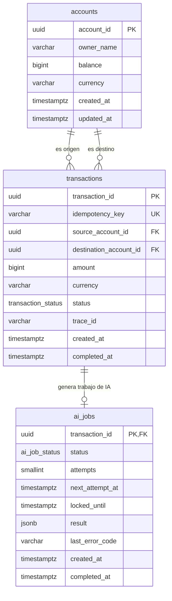

# SmartBancs App — Documento de Arquitectura

## 1. Objetivo y Alcance

Este documento y el código que lo acompaña resuelven el reto técnico "SmartBancs App".

## 2. Stack Tecnológico Elegido

| Componente | Tecnología | Justificación |
|---|---|---|
| API transaccional | Python + FastAPI | I/O-bound, concurrencia con asyncio, tipado con Pydantic, fácil de instrumentar. |
| Base de datos transaccional | PostgreSQL | ACID fuerte, índices, particionamiento, MVCC, soporte de observabilidad (`pg_stat_activity`, `pg_locks`). |
| Cache | Redis | Baja latencia, soporta patrón pub/sub y colas de consumidores para desacoplar IA y sync con Bancs. |
| Patrón de integración con Bancs | Outbox + workers batch | Evita saturar el core legado con escritura directa. |
| Servicio de IA | Microservicio independiente (FastAPI) | Aislar el módulo de IA para ser consumido de forma asíncrona. |
| Observabilidad | Grafana + Prometheus | Estándar de facto, bajo costo de operación, exportable a Grafana/Loki/Tempo. |
| IaC | Docker Compose | Un solo comando (`docker compose up`) levanta todo el entorno de desarrollo. |

---

## 3. Arquitectura de la App

## 4. Modelado de la Base de Datos

| Tabla | Responsabilidad | Motivo |
| --- | --- | --- |
| `accounts` | Contiene las cuentas que pueden enviar o recibir dinero. | Evita recalcular todo el historial para conocer el saldo. |
| `transactions` | Transferencias confirmadas entre dos cuentas. | Conserva el movimiento e impide duplicar su identificador. |
| `ai_jobs` | Una tarea de IA por transferencia, con intentos y resultado. | Permite ejecutar la recomendación después de confirmar el dinero. |

Una cuenta puede ser origen o destino de muchas transferencias. Cada tarea pertenece a una sola transferencia: `transaction_id` es clave primaria y foránea. La FK permite cero o una tarea; la API crea exactamente una junto con cada transferencia, dentro de la misma transacción SQL.

Los importes son `BIGINT` en centavos de USD: no hay redondeo binario de punto flotante. La API sólo acepta enteros positivos, verifica ambas monedas y evita sobrepasar el máximo de `BIGINT` en la cuenta destino. El esquema actual permite otras monedas, por lo que la validación de USD del servicio es necesaria. El saldo almacenado facilita lecturas; se modifica únicamente dentro de la transacción que registra el movimiento.

UUID permite generar identificadores antes de insertar sin coordinar una secuencia entre procesos; se acepta un índice mayor que el de un entero para simplificar identidad entre componentes. Los enums de PostgreSQL restringen estados conocidos y se reflejan con `StrEnum` en Python; añadir o cambiar estados requiere una migración coordinada. `JSONB` se limita al resultado variable de IA, no a datos contables. Las FK y checks protegen referencias, saldos no negativos, importes positivos y consistencia de estados aun ante errores del código.

Los índices de pendientes y reservas vencidas apoyan la selección de tareas del worker. La clave de idempotencia única protege reintentos; no equivale a un identificador de autenticación. El MVP guarda transferencias confirmadas; los intentos rechazados se observan en logs, no como filas financieras `failed`. Los otros estados del enum se conservan para evolución, sin inventar transiciones que el código no implementa.

### Atomicidad y concurrencia

1. Buscar una transferencia con la misma clave y comparar origen, destino, monto y moneda.
2. Bloquear ambas cuentas con `SELECT ... ORDER BY account_id FOR UPDATE`. Adquirirlas en orden estable evita los ciclos habituales entre transferencias opuestas.
3. Volver a consultar la clave tras adquirir los bloqueos: otro intento pudo completarse durante la espera.
4. Validar cuentas, moneda, saldo y capacidad del destino; insertar la transferencia con unicidad, actualizar ambos saldos e insertar `ai_jobs`.
5. Confirmar el commit y recién entonces responder `201`. Cualquier fallo revierte todos los pasos; repetir los mismos datos devuelve `200` sin otro débito.

El pool de la API tiene 10 conexiones y el worker 2, con espera de 500 ms, `lock_timeout` de 500 ms y `statement_timeout` de 1000 ms por sentencia.

### Desacoplamiento y recuperación de IA

El worker reserva un trabajo con `FOR UPDATE SKIP LOCKED`, incrementa el intento y establece una reserva de 30 segundos. Confirma esa reserva antes de HTTP. Así se pueden ejecutar varios workers sin procesar simultáneamente la misma reserva ni retener bloqueos durante la inferencia.

### Seguridad y observabilidad

SQL parametrizado, validación de importes/UUID, campos extra rechazados y respuestas de error sin detalles internos reducen errores e inyección. Las credenciales se inyectan por entorno y no se imprimen; la imagen corre sin privilegios de root. Los puertos publicados en localhost limitan acceso durante la demostración. No hay aún autenticación, autorización por cuenta, TLS ni rol SQL de mínimo privilegio; son requisitos pendientes antes de exponer el sistema y no capacidades ya implementadas.

Los logs JSON registran éxito, rechazo, errores, commit y procesamiento IA. `trace_id` une API, transferencia y worker; no representa por sí solo una traza distribuida con spans. El nombre de operación SQL, `backend_pid`, duración y SQLSTATE permiten localizar esperas y deadlocks con `pg_stat_activity`. Las métricas no usan IDs como etiquetas, para evitar crecimiento de series por cada operación. Ver [observabilidad](observability.md) para consultas, alertas y diagnóstico.

## 5. Estrategia de Sincronización con Legacy Bancs

**Problema**: Bancs es un sistema transaccional heredado, robusto pero poco flexible, que no puede recibir un alto volumen de consultas directas sin que su rendimiento se degrade.