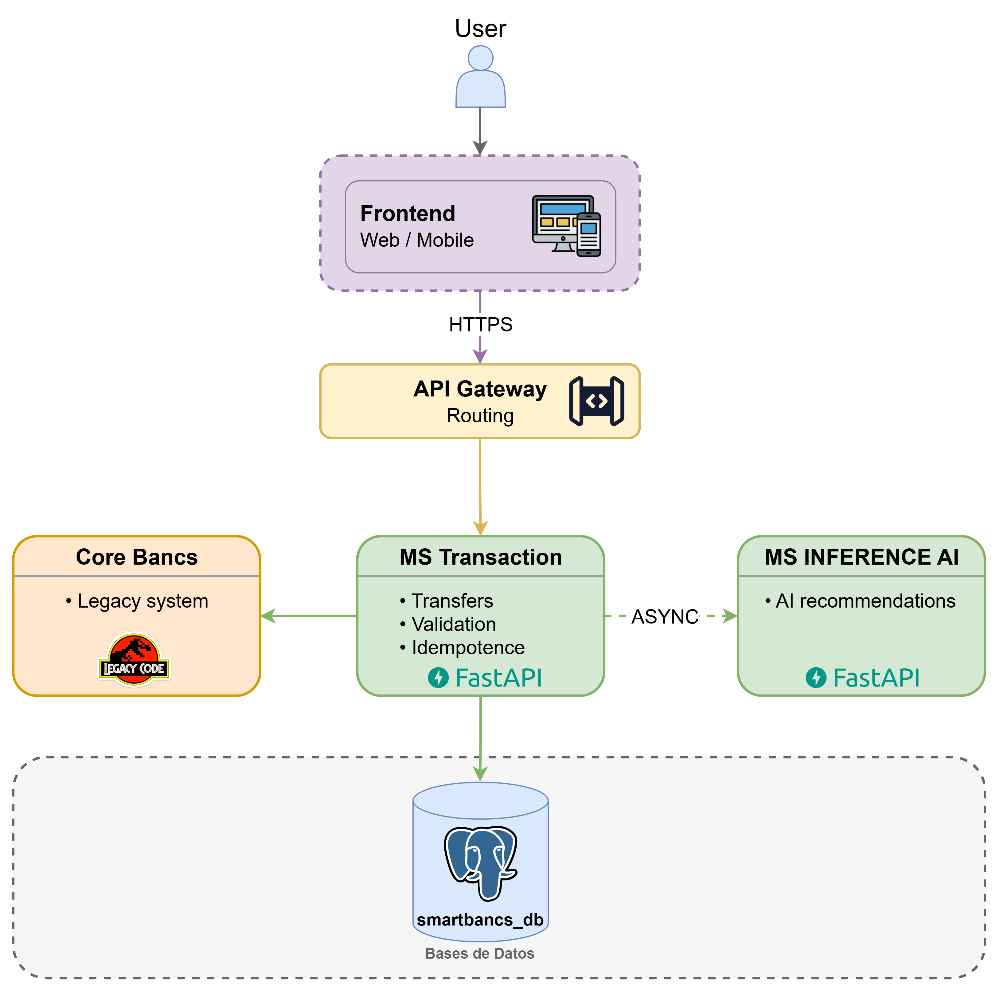
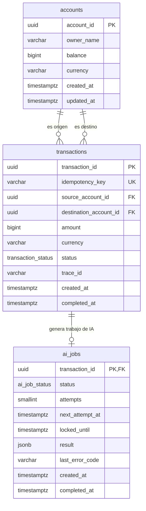
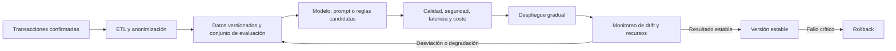

# SmartBancs App — Documento de Arquitectura

## 1. Objetivo y Alcance

Este documento y el código que lo acompaña resuelven el reto técnico "SmartBancs App", la cual es una
plataforma orientada a procesar transacciones en tiempo real y ofrecer recomendaciones financieras personalizadas impulsadas por inteligencia artificial.

## 2. Stack Tecnológico Elegido

| Componente | Tecnología | Justificación |
|---|---|---|
| API transaccional | Python + FastAPI | Contratos claros con Pydantic, documentación OpenAPI y handlers síncronos que FastAPI ejecuta en su pool de hilos para no bloquear el servidor. |
| Base de datos transaccional | PostgreSQL | ACID, restricciones, MVCC, locks por fila e inspección con `pg_stat_activity` y `pg_locks`. |
| Patrón de integración con Bancs | Workers por lotes (propuesta teórica) | Limitaría la presión sobre el core y permitiría reintentos y conciliación. No está desplegado en el MVP. |
| Servicio de IA | Microservicio independiente (FastAPI) | Aislar el módulo de IA para ser consumido de forma asíncrona. |
| Observabilidad | Prometheus + logs JSON | Permite medir los dos servicios y correlacionar eventos con `trace_id`; los paneles y trazas distribuidas quedan como evolución. |
| IaC | Docker Compose | Un solo comando (`docker compose up`) levanta todo el entorno de desarrollo. |

---

## 3. Arquitectura de la App



## 4. Modelado de la Base de Datos

| Tabla | Responsabilidad | Motivo |
| --- | --- | --- |
| `accounts` | Contiene las cuentas que pueden enviar o recibir dinero. | Evita recalcular todo el historial para conocer el saldo. |
| `transactions` | Transferencias confirmadas entre dos cuentas. | Conserva el movimiento e impide duplicar su identificador. |
| `ai_jobs` | Una tarea de IA por transferencia, con intentos y resultado. | Permite ejecutar la recomendación después de confirmar el dinero. |



Una cuenta puede ser origen o destino de muchas transferencias. Cada tarea pertenece a una sola transferencia: `transaction_id` es clave primaria y foránea. La FK permite cero o una tarea; la API crea exactamente una junto con cada transferencia, dentro de la misma transacción SQL.

Los importes son `BIGINT` en centavos de USD: no hay redondeo binario de punto flotante. La API sólo acepta enteros positivos, verifica ambas monedas y evita sobrepasar el máximo de `BIGINT` en la cuenta destino. El esquema actual permite otras monedas, por lo que la validación de USD del servicio es necesaria. El saldo almacenado facilita lecturas; se modifica únicamente dentro de la transacción que registra el movimiento.

UUID permite generar identificadores antes de insertar sin coordinar una secuencia entre procesos; se acepta un índice mayor que el de un entero para simplificar identidad entre componentes. Los enums de PostgreSQL restringen estados conocidos y se reflejan con `StrEnum` en Python; añadir o cambiar estados requiere una migración coordinada. `JSONB` se limita al resultado variable de IA, no a datos contables. Las FK y checks protegen referencias, saldos no negativos, importes positivos y consistencia de estados aun ante errores del código.

Los índices de pendientes y reservas vencidas apoyan la selección de tareas del worker. La clave de idempotencia única protege reintentos; no equivale a un identificador de autenticación. El MVP guarda transferencias confirmadas; los intentos rechazados se observan en logs, no como filas financieras `failed`. Los otros estados del enum se conservan para evolución, sin inventar transiciones que el código no implementa.

### Atomicidad y concurrencia

1. Buscar una transferencia con la misma clave y comparar origen, destino, monto y moneda.
2. Bloquear ambas cuentas con `SELECT ... ORDER BY account_id FOR UPDATE`. Adquirirlas en orden estable evita los ciclos habituales entre transferencias opuestas.
3. Volver a consultar la clave tras adquirir los bloqueos: otro intento pudo completarse durante la espera.
4. Validar cuentas, moneda, saldo y capacidad del destino; insertar la transferencia con unicidad, actualizar ambos saldos e insertar `ai_jobs`.
5. Confirmar el commit y recién entonces responder `201`. Cualquier fallo revierte todos los pasos; repetir los mismos datos devuelve `200` sin otro débito.

El pool de la API tiene 10 conexiones y el worker 2, con espera de 500 ms, `lock_timeout` de 500 ms y `statement_timeout` de 1000 ms por sentencia.

### Desacoplamiento y recuperación de IA

El worker reserva un trabajo con `FOR UPDATE SKIP LOCKED`, incrementa el intento y establece una reserva de 30 segundos. Confirma esa reserva antes de HTTP. Así se pueden ejecutar varios workers sin procesar simultáneamente la misma reserva ni retener bloqueos durante la inferencia.

### Seguridad y observabilidad

SQL parametrizado, validación de importes/UUID, campos extra rechazados y respuestas de error sin detalles internos reducen errores e inyección. Las credenciales se inyectan por entorno y no se imprimen; la imagen corre sin privilegios de root. Los puertos publicados en localhost limitan acceso durante la demostración. No hay aún autenticación, autorización por cuenta, TLS ni rol SQL de mínimo privilegio; son requisitos pendientes antes de exponer el sistema y no capacidades ya implementadas.

Los logs JSON registran éxito, rechazo, errores, commit y procesamiento IA. `trace_id` une API, transferencia y worker; no representa por sí solo una traza distribuida con spans. El nombre de operación SQL, `backend_pid`, duración y SQLSTATE permiten localizar esperas y deadlocks con `pg_stat_activity`. Las métricas no usan IDs como etiquetas, para evitar crecimiento de series por cada operación. Ver la [guía de respuesta a incidentes](incident-response.md) para consultas, alertas, diagnóstico y escalamiento.

## 5. Estrategia de Sincronización con Legacy Bancs

**Problema**: Bancs es un sistema transaccional heredado, robusto pero poco flexible, que no puede recibir un alto volumen de consultas directas sin que su rendimiento se degrade.

Esta sección es una **propuesta teórica**, como solicita el reto. El MVP usa PostgreSQL como ledger local de demostración y no se comunica con Bancs. En una implantación bancaria, Bancs seguiría siendo el sistema de registro del saldo oficial hasta que el negocio asigne explícitamente esa responsabilidad a otro componente.

### Flujo propuesto

1. La API validaría la solicitud, aplicaría idempotencia y guardaría la operación local junto con un evento de integración dentro de la misma transacción SQL. El patrón evita confirmar dinero sin dejar registro de lo que debe enviarse.
2. Un worker leería eventos pendientes en lotes pequeños. Tendría límites de concurrencia y solicitudes por segundo para proteger Bancs durante los picos.
3. Cada envío incluiría un identificador idempotente y un identificador de lote. Repetir el envío por timeout no debería crear otro movimiento en Bancs.
4. Los errores temporales se reintentarían con espera exponencial y un pequeño valor aleatorio (*jitter*). Los rechazos permanentes pasarían a revisión operativa, sin repetirse indefinidamente.
5. La respuesta de Bancs actualizaría un estado de sincronización separado del resultado técnico del request HTTP.
6. Un proceso periódico compararía identificadores, importes y totales entre ambos sistemas. Las diferencias se reportarían para conciliación y nunca se corregirían silenciosamente.

### Estados y consistencia

El banco debe acordar qué significa “completada”. Si el saldo oficial depende de la confirmación de Bancs, la API debería responder `accepted/pending` y sólo pasar a `completed` después de esa confirmación. El `completed` inmediato del MVP demuestra atomicidad en PostgreSQL local; no significa liquidación confirmada por el core.

La tabla de eventos de integración y el worker Bancs no se añaden a este incremento. Implementarlos sin un contrato real de Bancs inventaría respuestas, estados y reglas de conciliación, mientras que el lineamiento solicita explicar la estrategia.

## 6. Inteligencia Artificial: Implementación y Despliegue

Se optó por un mock funcional mediante consumo HTTP, validación, persistencia por el worker, telemetría y fallos controlados. A continuación, se presentan los posibles escenarios para el modelo de IA:

| Alternativa | Ventaja | Coste o limitación |
|---|---|---|
| Mock elegido | Demostración reproducible, sin cuentas externas ni coste de inferencia | No demuestra calidad de un modelo real |
| Gemini o GPT por API | Permite demostrar integración con un modelo | Añade credenciales, cuotas, coste, latencia variable y evaluación de salidas |
| Modelo propio | Mayor control del modelo | Requiere dataset, entrenamiento y recursos fuera de este incremento junior |

### Diseño y justificación

`POST /recommendations` recibe `transaction_id` UUID, `amount` entero positivo en centavos de USD y `currency: "USD"`. Rechaza campos adicionales y responde con el mismo ID, una recomendación y `mode: "mock"`. Mantiene el contrato que el worker ya valida, sin alterar la operación financiera ni el esquema SQL.

```text
ms-inference-ai/
  app/
    main.py       # HTTP, errores y simulación de demora/fallo
    schemas.py    # Entrada y salida Pydantic
    service.py    # Tres reglas de demostración
    config.py     # Variables de entorno validadas
    telemetry.py  # Logs JSON y métricas
  tests/
  Dockerfile
```

FastAPI y Pydantic conservan el estilo de transacciones. Se usan versiones iguales de dependencias comunes; no se agregan frameworks de agentes, SDK de proveedores ni interfaces abstractas para una sola implementación.

### Ciclo de vida del modelo en producción

El MVP actual utiliza reglas deterministas y, por lo tanto, no entrena un modelo ni aprende automáticamente de las transacciones. El siguiente ciclo de vida describe la evolución teórica hacia un modelo real. La primera opción sería consumir un modelo administrado, como Gemini o GPT, porque reduce la infraestructura necesaria para un equipo pequeño. El microservicio de IA conservaría el mismo contrato HTTP, de modo que el servicio transaccional y su worker no dependerían del proveedor elegido.

#### Alimentación con nuevos datos

Los datos se incorporarían mediante un proceso periódico y separado del flujo transaccional. Las transferencias confirmadas se extraerían desde una réplica o una zona analítica, se limpiarían mediante el proceso ETL y se transformarían en variables útiles, por ejemplo: rangos de importe, frecuencia de movimientos, categorías de gasto y variación frente al comportamiento histórico. No se consultaría Bancs directamente por cada recomendación, porque esto aumentaría su carga y acoplaría la IA al core legado.

Antes de usar los datos se eliminarían identificadores directos, se aplicarían reglas de calidad y se conservarían únicamente los campos autorizados para el caso de uso. Los datos sensibles no se incluirían en el prompt si no son necesarios. Cada conjunto de datos tendría una versión, fecha de generación, reglas de transformación y métricas de calidad para poder reproducir una evaluación.

Con un proveedor como Gemini o GPT no se reentrenaría inicialmente el modelo base. Los datos nuevos se utilizarían para actualizar el contexto, las reglas y un conjunto de evaluación controlado. Si en el futuro existieran suficientes datos validados y un objetivo medible, podría evaluarse un modelo especializado o *fine-tuning*. Esa decisión requeriría aprobación de seguridad, privacidad y riesgo del banco.

#### Evaluación, versionado y despliegue

Cada cambio de modelo, prompt, reglas o variables se trataría como una nueva versión. Antes de publicarla se ejecutaría con un conjunto de casos representativos y se compararían al menos: validez del formato, utilidad de la recomendación, ausencia de datos sensibles, respuestas inseguras, latencia y coste por solicitud. La salida del modelo siempre se validaría con el esquema Pydantic antes de almacenarla.

La versión candidata se desplegaría primero en un entorno de pruebas y después mediante una liberación gradual, por ejemplo al 5 % del tráfico. Se compararía con la versión estable y sólo se ampliaría su uso si mantiene los umbrales definidos. Se conservaría la versión anterior para realizar un rollback rápido. Los registros deberían incluir la versión del modelo, prompt y reglas, pero no el contenido sensible enviado al proveedor.

#### Monitoreo de *data drift*

El *data drift* ocurre cuando los datos recibidos en producción cambian respecto de los utilizados para diseñar o evaluar la solución. Se compararía diaria o semanalmente la distribución de variables como importe, frecuencia, moneda, categoría y cantidad de transacciones por cliente contra una línea base. Para un MVP pueden utilizarse porcentajes por rango y el índice de estabilidad poblacional (PSI); no es necesario comenzar con una plataforma compleja.

También se vigilaría el comportamiento de las salidas: proporción de cada tipo de recomendación, respuestas rechazadas por validación, contenido inseguro, tasa de recomendaciones repetidas y retroalimentación de usuarios. Esto permite detectar *concept drift*: los datos pueden parecer similares, pero las recomendaciones dejan de ser útiles.

Los umbrales se definirían con datos reales y no de forma arbitraria. Por ejemplo, un cambio sostenido del PSI, un aumento de respuestas inválidas o una caída en la aceptación generaría una alerta para revisión. La respuesta sería analizar la causa, actualizar el conjunto de evaluación o las transformaciones y desplegar una nueva versión. No se actualizaría el modelo automáticamente con datos recientes sin validación humana, porque una recomendación financiera incorrecta puede afectar al cliente.

#### Gestión del consumo de recursos

Las recomendaciones continuarían fuera de la transacción financiera y serían procesadas por workers. Así se puede limitar la concurrencia hacia el proveedor, aplicar cuotas y escalar los workers sin aumentar las conexiones de la API transaccional. La cola persistente `ai_jobs`, el timeout y los tres intentos existentes evitan esperas indefinidas; la deduplicación por `transaction_id` impediría pagar dos veces por la misma inferencia.

Para controlar coste y capacidad se medirían solicitudes, tokens de entrada y salida, latencia, errores, reintentos y coste estimado por recomendación. Se establecerían un tamaño máximo de prompt, una salida breve, límites de solicitudes por segundo y presupuestos diarios o mensuales. Cuando el proveedor alcance su cuota o presupuesto, el worker mantendría la tarea pendiente o la marcaría para revisión según la política definida, sin bloquear ni revertir la transferencia.

Se elegiría el modelo más pequeño que cumpla los criterios de calidad y se reservarían modelos más costosos para casos que realmente lo necesiten. El escalamiento se basaría en la cantidad y antigüedad de trabajos pendientes, uso de CPU/memoria y límites del proveedor. Las métricas actuales de `ai_jobs`, latencia y errores constituyen la base operativa; en producción se añadirían consumo de tokens, coste y versión del modelo.



Este ciclo separa la actualización de IA del procesamiento del dinero. Una nueva versión puede cambiar o degradarse sin comprometer la atomicidad de las transferencias, y el mock actual continúa siendo una alternativa explícita para desarrollo y pruebas.

## 7. Observabilidad

### Qué mirar y por qué

| Señal | Utilidad |
|---|---|
| `http_requests_total` por método, ruta y código | Separar tráfico, rechazos de negocio y errores de servidor |
| `http_request_duration_seconds` | Identificar degradación de latencia; el objetivo del reto es menor a 2 s |
| `transactions_total` por resultado | Separar transferencias nuevas, duplicadas, rechazadas y fallos de base |
| `db_operation_duration_seconds` por operación | Identificar el paso SQL que consume tiempo |
| `db_pool_wait_seconds` | Distinguir espera de conexión de una consulta lenta |
| `db_errors_total` por tipo | Diferenciar deadlock, lock timeout, statement timeout y saturación del pool |
| `ai_request_duration_seconds`, `ai_requests_total` | Detectar demora y fallos del servicio IA |
| `ai_jobs`, `ai_oldest_pending_age_seconds` | Observar estado y acumulación de tareas en el worker |
| `inference_requests_total` y métricas HTTP del job `ms-inference-ai` | Separar resultados del mock y su latencia de la observada por el worker |

Los IDs no se usan como etiquetas métricas: crear una serie por transferencia consumiría memoria sin límite. Se reservan para logs. Se ejecuta un proceso Uvicorn por contenedor porque los contadores viven en memoria; al escalar, Prometheus debe recoger cada réplica. No aumentar `--workers` sin configurar antes el modo multiproceso de métricas.

Logs críticos: `database_commit`, `transaction_completed`, `transaction_duplicate`, `operation_rejected`, `database_failure`, `db_operation_failed`, `db_operation_slow`, `unexpected_error`, `job_started`, `ai_call_finished` y `job_finished`. Los eventos del worker comparten el `trace_id` original. Una nueva petición HTTP de reintento puede tener otro trace; la respuesta mantiene la transacción y el trace original persistidos.

El worker actualiza los totales de tareas cada 15 segundos; no recorre el historial después de cada trabajo. Ese agregado todavía crece con el historial, por lo que un sistema de mayor volumen necesitaría retención, estadísticas o un recolector independiente.

### Consultas en Prometheus

Transacciones nuevas por segundo:

```promql
sum(rate(transactions_total{job="ms-transaction",result="completed"}[5m]))
```

Latencia p95 de recepción de transferencias, incluidos errores y duplicados:

```promql
histogram_quantile(0.95, sum by (le) (
  rate(http_request_duration_seconds_bucket{job="ms-transaction",route="/transactions",method="POST"}[5m])
))
```

La métrica es una distribución, no una garantía de que cada transferencia tarde menos de dos segundos. `lock_timeout=500 ms` y `statement_timeout=1000 ms` limitan cada operación SQL, no la duración acumulada de toda la petición. El objetivo necesita pruebas de carga con datos, contención y recursos representativos.

### Diagnosticar timeouts y bloqueos

1. Ubicar el intervalo con errores/latencia y el `trace_id` afectado.
2. Buscar `db_operation_failed` o `db_operation_slow`: `operation` indica el SQL lógico y `backend_pid` el proceso exacto; `55P03` señala lock timeout, `40P01` deadlock y `57014` cancelación por tiempo límite en esta configuración.
3. Conectar como administrador a PostgreSQL y observar bloqueadores mientras el incidente está activo:

```sql
SELECT pid, application_name, state, wait_event_type, wait_event,
       now() - query_start AS query_age,
       pg_blocking_pids(pid) AS blocking_pids,
       query
FROM pg_stat_activity
WHERE datname = current_database()
  AND pid <> pg_backend_pid()
ORDER BY query_start;
```

El PID puede reutilizarse después de terminar una sesión; correlacionarlo con la hora y `application_name` (`ms-transaction` o `transaction-worker`). El nombre de operación corresponde a la consulta en `service.py` o `worker.py`; por ejemplo, `lock_accounts` identifica la adquisición ordenada de bloqueos. La inspección de actividad SQL queda restringida a administradores porque otras consultas podrían contener datos sensibles.

Los bloqueos de cuenta se adquieren en orden UUID para evitar ciclos habituales entre transferencias opuestas. PostgreSQL sigue siendo quien detecta deadlocks de otras operaciones. Ante contención, el cliente recibe `503` y puede reintentar con la misma clave de idempotencia. Una cancelación no debe ejecutarse automáticamente sólo por detectar una consulta lenta: identificar primero la sesión y el impacto.

Las reglas locales de alerta tienen umbrales iniciales para la demostración; necesitan ajustarse con una línea base. Prometheus no reúne logs ni crea spans: paneles, agregación de logs, OpenTelemetry y un canal de alertas son ampliaciones posibles. La [guía de incidente](incident-response.md), las [consultas SQL](../scripts/incident_queries.sql) y la [plantilla de post mortem](postmortem-template.md) cubren el ejercicio operativo del reto.
